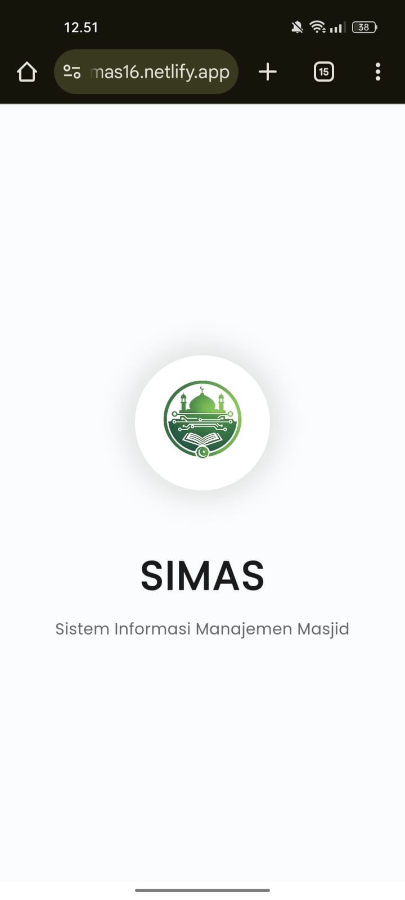
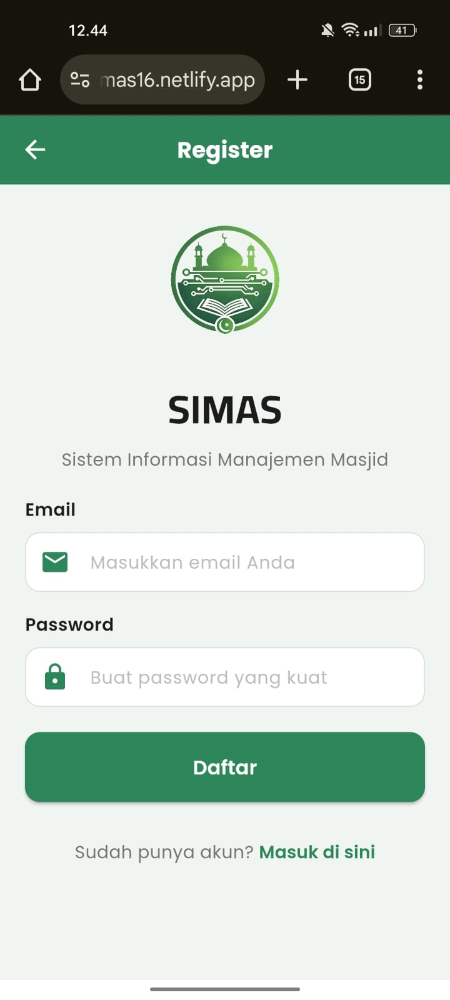
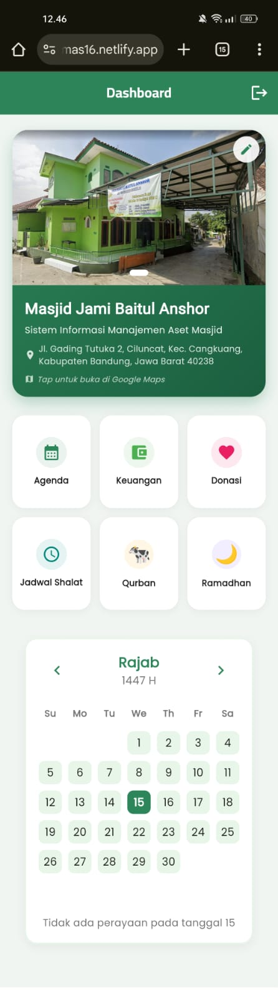

# 📱 SIMAS - Sistem Informasi Masjid

**SIMAS** adalah aplikasi mobile berbasis Flutter untuk mengelola data dan kegiatan masjid secara terintegrasi. Aplikasi ini dirancang untuk memudahkan pengelolaan agenda, keuangan, qurban, donasi, ramadhan, dan jadwal shalat dengan fitur autentikasi Firebase.

## 👤 Developer

- **Nama**: Nazwa Khoerunnisa
- **NIM**: 23552011093
- **Kelas**: TIF RP 23 CNS C
- **Mata Kuliah**: Pemrograman Mobile 2
- **Tahun**: 2025

---

## 📱 Tentang Aplikasi

SIMAS adalah Sistem Informasi Manajemen Masjid yang dibangun menggunakan Flutter dan terintegrasi dengan Firebase. Aplikasi ini menyediakan berbagai fitur untuk meningkatkan efisiensi pengelolaan masjid dengan interface yang user-friendly dan responsif.

### ✨ Fitur Utama

- **🗓️ Manajemen Agenda**: Buat, edit, dan kelola agenda kegiatan masjid
- **💰 Manajemen Keuangan**: Kelola pemasukan dan pengeluaran masjid
- **🐑 Manajemen Qurban**: Kelola data dan proses qurban
- **🤝 Manajemen Donasi**: Terima dan kelola donasi dari jemaah
- **📅 Manajemen Ramadhan**: Kelola agenda khusus bulan Ramadhan
- **⏰ Jadwal Shalat**: Tampilkan jadwal shalat terintegrasi
- **🔐 Autentikasi Firebase**: Sistem login aman menggunakan Firebase Authentication
- **📱 Responsive Design**: Aplikasi yang beradaptasi dengan berbagai ukuran layar

---

## 🛠️ Tech Stack

- **Frontend**: Flutter 3.9.2
- **Backend**: Firebase (Authentication, Firestore Database)
- **State Management**: Provider + Riverpod
- **UI Framework**: Material Design
- **Additional Libraries**:
  - `google_fonts`: Custom fonts untuk UI yang modern
  - `intl`: Internationalization & Localization
  - `image_picker`: Image selection dari device
  - `http`: HTTP requests ke backend
  - `shared_preferences`: Local storage untuk data lokal
  - `url_launcher`: Open URLs & emails
  - `path_provider`: File system access

---

## 📋 Persyaratan Sistem

- **Flutter SDK**: `^3.9.2`
- **Dart SDK**: Included with Flutter
- **Android API Level**: 21+
- **iOS**: 11.0+

---

## 🚀 Cara Instalasi & Menjalankan

### 1. Clone Repository

```bash
git clone https://github.com/NazwaKhoerunnisa/simas-uas-pemob2.git
cd simas-uas-pemob2
cd SIMAS
```

### 2. Install Dependencies

```bash
flutter pub get
```

### 3. Setup Firebase (Optional jika belum dikonfigurasi)

```bash
flutterfire configure
```

### 4. Jalankan Aplikasi

**Di Android Emulator/Device:**
```bash
flutter run
```

**Di iOS Simulator/Device:**
```bash
flutter run -d macos
```

**Di Web:**
```bash
flutter run -d web
```

**Di Windows:**
```bash
flutter run -d windows
```

---

## 📁 Struktur Project

```
SIMAS/
├── lib/
│   ├── main.dart                 # Entry point aplikasi
│   ├── screens/                  # Halaman aplikasi (30+ screens)
│   │   ├── splash_page.dart
│   │   ├── login_page.dart
│   │   ├── register_page.dart
│   │   ├── dashboard_page.dart
│   │   ├── agenda_*.dart
│   │   ├── keuangan_*.dart
│   │   ├── qurban_*.dart
│   │   ├── donasi_*.dart
│   │   ├── ramadhan_*.dart
│   │   └── jadwal_shalat_page.dart
│   ├── core/
│   │   ├── constants/            # App constants & colors
│   │   └── utils/                # Utility functions & animations
│   ├── data/
│   │   ├── models/               # Data models (8+ models)
│   │   └── services/             # API & Firebase services
│   └── presentation/
│       ├── pages/                # Complex pages
│       ├── providers/            # State providers (Riverpod)
│       ├── theme/                # Theme configuration
│       └── widgets/              # Reusable widgets
├── android/                      # Android native files
├── ios/                          # iOS native files
├── web/                          # Web files
├── windows/                      # Windows native files
├── pubspec.yaml                  # Dependencies
└── firebase.json                 # Firebase config
```

---

## 🔐 Autentikasi

Aplikasi menggunakan **Firebase Authentication** untuk keamanan user:
- ✅ Login dengan email/password
- ✅ Registrasi user baru
- ✅ Manajemen session
- ✅ Logout
- ✅ Password reset

---

## 💾 Database

Menggunakan **Firebase Firestore** untuk penyimpanan data:
- 📊 Menyimpan data agenda
- 💵 Menyimpan data keuangan
- 🐑 Menyimpan data qurban
- 💝 Menyimpan data donasi
- 📅 Menyimpan data ramadhan
- 🕌 Menyimpan profil masjid

---

## 🎨 Tema & Desain

Aplikasi menggunakan **Material Design** dengan tema yang disesuaikan untuk suasana masjid yang profesional dan elegan:

- **Font**: Google Fonts untuk UI yang modern
- **Color Scheme**: Kombinasi warna yang mencerminkan spiritual namun profesional
- **Animasi**: Smooth transitions & animated widgets untuk UX yang baik

---

## 📸 Galeri Screenshot

Berikut adalah tampilan dari aplikasi SIMAS:

### Authentication Pages

| Splash Screen | Login | Register |
|:---:|:---:|:---:|
|  |  |  |

### Dashboard

| Dashboard |
|:---:|
|  |

### Manajemen Agenda

| List Agenda | Detail Agenda | Add Agenda | Update Agenda |
|:---:|:---:|:---:|:---:|
|  |  |  |  |

### Manajemen Keuangan

| Keuangan Masjid | Add Keuangan | Update Keuangan | Download Laporan |
|:---:|:---:|:---:|:---:|
|  |  |  |  |

### Manajemen Qurban

| Program Qurban | Detail Qurban | Add Qurban | Fitur Zakat Mal |
|:---:|:---:|:---:|:---:|
|  |  |  |  |

### Manajemen Donasi & Zakat

| Program Donasi | Detail Donasi | Add Donasi | Edit/Delete Donasi |
|:---:|:---:|:---:|:---:|
|  |  |  |  |

| Add Zakat Fitrah | Add Zakat Mal |
|:---:|:---:|
|  |  |

### Manajemen Ramadhan & Jadwal

| Program Ramadhan | List Imsak & Buka | Add Jadwal Imsak/Buka | Jadwal Takjil |
|:---:|:---:|:---:|:---:|
|  |  |  |  |

| Add Jadwal Takjil | Jadwal Shalat | Edit Profil |
|:---:|:---:|:---:|
|  |  |  |

---

## 📚 Dokumentasi Lengkap

Dokumentasi lengkap termasuk video tutorial dan screenshot telah ditambahkan di folder `docs/`:

### Video Demo

Tonton demo walkthrough aplikasi SIMAS:

📹 **[Download Video Demo](docs/videos/demo-walkthrough.mp4)** (56.6 MB)

Atau buka file: `docs/videos/demo-walkthrough.mp4`

### Struktur Dokumentasi:
```
docs/
├── screenshots/     # Screenshot aplikasi (29 images)
├── videos/          # Video tutorial & demo
│   └── demo-walkthrough.mp4
└── guides/          # Panduan penggunaan (coming soon)
```

---

## 📌 Catatan Pengembangan

* Proyek ini dikembangkan secara **individual** sebagai UAS
* Data awalnya menggunakan **MockAPI** untuk kebutuhan pembelajaran
* Aplikasi difokuskan pada fungsi manajemen internal masjid
* Terintegrasi dengan **Firebase** untuk production-ready features

---

## 📝 Lisensi

Project ini adalah bagian dari **UAS Pemrograman Mobile II**.

---

## 📞 Hubungi Kami

Untuk pertanyaan atau saran, silakan hubungi melalui:
- GitHub Issues: [simas-uas-pemob2/issues](https://github.com/NazwaKhoerunnisa/simas-uas-pemob2/issues)
- Email: nazwa.khoerunnisa@example.com

---

## 📎 Repository GitHub

Repository ini dibuat sebagai pemenuhan tugas progres **UAS Pemrograman Mobile 2**.

**Repository**: https://github.com/NazwaKhoerunnisa/simas-uas-pemob2

---

**Status**: ✅ Development Complete | 🎯 Ready for Production | 📱 Multi-Platform Support

